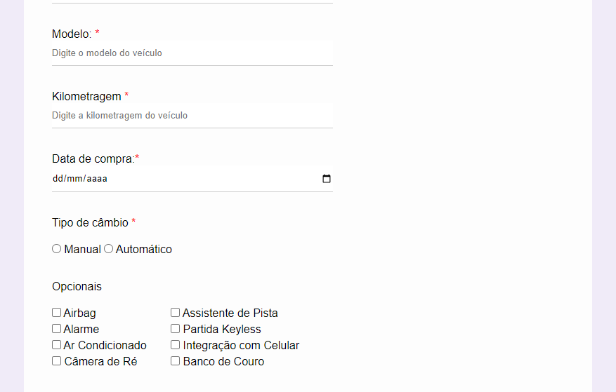

# Formulário Básico 

### Formulário criado em janeiro/2024 para praticar conhecimentos em HTML e CSS.

### Primeria tela:

### Segunda tela:

Observação: Essa tela acima ainda não esta completa e uma parte dela esta errada.

### Terceira tela:

### Tecnologias usadas no projeto:

- HTML5
- CSS3
